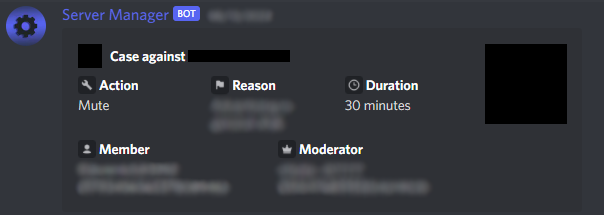
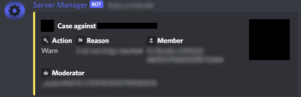

import Button from '../../src/components/Button';
import {
  DiscordInteraction,
  DiscordMessage,
  DiscordMessages,
  DiscordEmbed,
  DiscordEmbedField,
  DiscordEmbedFields,
} from "discord-message-components/packages/react";
import "discord-message-components/packages/react/dist/style.css";

:::caution Warning

To use any of these commands, you need to have **Manage Guild** permissions or be in one or more of the `admin_roles` config roles set by the server.

:::

## Administrator Roles

:::note

Anyone with **Manage Guild** permissions or higher automatically by-pass this check.

:::

| Usage | Description | Premium |
| ----------- | ----------- | ----------- |
| <code>/config admin_roles [hidden]</code> | View the server's admin roles | False |
| <code>/config admin_role add &lt;role&gt</code> | Add a role to the admin roles | False |
| <code>/config admin_role remove &lt;role&gt</code> | Remove a role from the admin roles | False |

## Moderator Roles

:::note

Anyone in the `admin_roles` role(s) configuration automatically by-pass this check.

:::

| Usage | Description | Premium |
| ----------- | ----------- | ----------- |
| <code>/config moderator_roles [hidden]</code> | View the server's moderator roles | False |
| <code>/config moderator_role add &lt;role&gt</code> | Add a role to the moderator roles | False |
| <code>/config moderator_role remove &lt;role&gt</code> | Remove a role from the moderator roles | False |

## Moderation Configurations

| Usage | Description | Premium |
| ----------- | ----------- | ----------- |
| <code>/config appeal_server_invite &lt;invite&gt</code> | Set the server's [appeal server invite](../updates/appeal-server-invite-notice.md) | <premium>True</premium> |

## Suggestion Configurations

| Usage | Description | Premium |
| ----------- | ----------- | ----------- |
| <code>/config suggestions_channel &lt;#channel&gt; </code> | Set the servers suggestion channel | False |
| <code>/config discussion_threads &lt;value&gt; </code> | Set the whether a thread should be created on suggestion creation | False |
| <code>/config suggestion_ping &lt;@role&gt; </code> | Set a role to be pinged when a suggestion is submitted - `None` by default | False |

## Custom Reasons

| Usage | Description | Premium |
| ----------- | ----------- | ----------- |
| <code>/config custom_reasons [hidden]</code> | View the server's custom reasons | False |
| <code>/config custom_reason add &lt;name&gt &lt;value&gt</code> | Add a custom reason - `name` will show up in slash command auto-complete for moderation commands and then will use `value` for the reason | False |

## Logging

:::note

Moderations action results are sent to this channel

  
Preview

  <h3>Mutes</h3>

  
  <h3>Warnings</h3>

  

:::

| Usage | Description | Premium |
| ----------- | ----------- | ----------- |
| <code>/config log_channel &lt;#channel&gt</code> | Set the server's log channel | False |

 