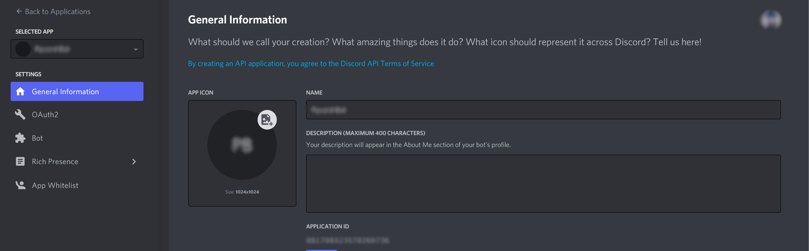
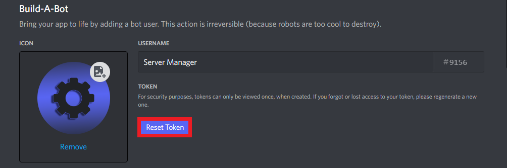
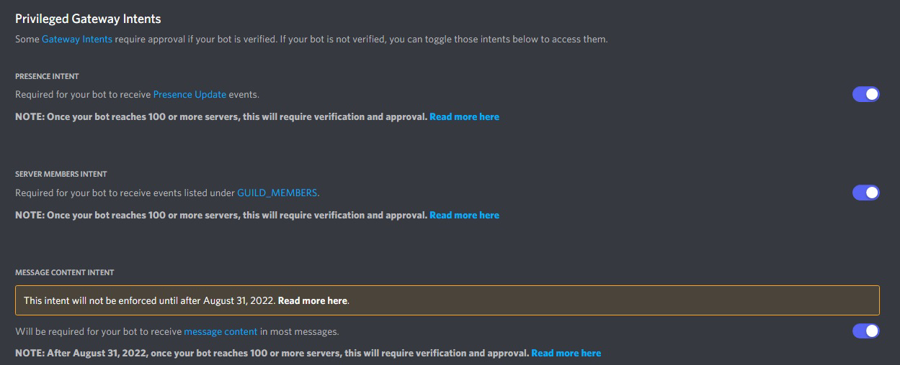

import Button from '../src/components/Button';
import Admonition from '@theme/Admonition';

Want to unlock the full potential of **Server Manager**? Support us on [Ko-fi](https://ko-fi.com).

## Supporter Tier
Support the bot with a $2 donation. This will help with hosting costs. To show our thanks, we're giving you Server Manager Premium as long as you keep paying monthly. Another perk to this is that you get a Premium Supporter role in the support server (only available if you're in the [support server](/support.html)).

### Perks
  - **Access to premium commands**
  - Access to **beta** features
  - The `Premium Supporter` role in the [support server](/support.html)
  - Exclusive sneak peaks

  <Button link="http://ko-fi.com/servermanager/tiers">Purchase</Button>

## Super Supporter Tier
**Get your very own custom branded Server Manager**! The custom client/bot will <u>not be modified code-wise what so ever</u>, however, it comes with free premium and a custom name/custom profile picture. All of this you can set on the Developer Portal on your Discord account. Please note that you will have to give the Developer the token from the Developer Portal in order for the bot to appear online. A status command is included in the custom bot so you can customize the bot's status to fit your server.

:::info

The **Advanced Supporter** tier is the same as this tier, but offers downgraded hosting compared to the Super Supporter Tier (the hosting that Server Manager uses).

:::

### Perks
  - Everything in the previous tier
  - **Custom branded Server Manager**

:::note
Please note that you must be in the [support server](/support.html) to be able to redeem this tier along with the other tiers! While you have this tier, your payment pays for the hosting for your bot. You also **do not** get access to your custom branded bot's code.

You will be able to customize the bot's profile picture and name to your liking as you will have access to the bot's application on the [Discord Developer Portal](https://discord.dev). You will have to give us this token to use or else the bot won't be online.

If you mess with the [Discord Developer Portal](https://discord.dev) application and it cause your bot to go offline, you will have to contact our support bot.
:::

### Redeeming

✨ Redeeming

<h2>Creating your Custom Branded Server Manager</h2>
 

:::note
We recommend prior knowledge of creating an application on the [Discord Developer Portal](https://discord.com/developers/applications) in order to follow along with these steps. If you need any help, feel free to shoot us a message via our Support Bot (**Helper#7371**) and we can try and provide extra support.
:::

**1.** Go to the [Discord Developer Portal](https://discord.com/developers/applications) and click <mention>New Application</mention>

**2.** Give your bot a name, and click <mention>Create</mention>

**3.** Once you've completed those 2 steps, you should be on this page: 

**4.** Click on the <mention>Bot</mention> tab on the left side of the screen. Then click <mention>Add Bot</mention>.

**5.** You can give it a name, change the Avatar, etc.

**6.** Navigate to where it says <mention>Reset Token</mention>, this is where you will be able to access your bot's token.

**7.** Once you complete the 2FA to reset your bot's token (if enabled), click <mention>Copy</mention> to copy it to your device's clipboard - you'll need this for later. **Make sure to not share it with anyone else**!

<h2>Enable Intents</h2>

**1.** Go to the <mention>Bot</mention> tab in your bot's application in the Developer Portal. Scroll down until you see the section: **Privileged Gateway Intents**.

**2.** Enable the following intents (the bot requires all of them):
  - Presence Intent
  - Server Members Intent
  - Message Content Intent

<Admonition type="tip" icon="✅" title="Success">
  

    You've created the bot application for your <strong>Custom Branded Server Manager bot</strong>!
     
     
    Please make sure to message our support bot (<strong>Helper#7371</strong>) in our <a href="https://servermangerbot.ml/support">support server</a> in order to redeem your custom bot, please also provide the <strong><u>token</u></strong> you have copied from earlier!
  

</Admonition>

  <Button link="http://ko-fi.com/servermanager/tiers">Purchase</Button>

## Donations
We greatly appriciate donations from the community. Your donations and premium purchases help with hosting costs and other development costs down the road. Unfortunately, we don't have any perks for donations. **However**, we will most likely come up with perks soon!

  <Button link="http://ko-fi.com/servermanager">Donate</Button>

